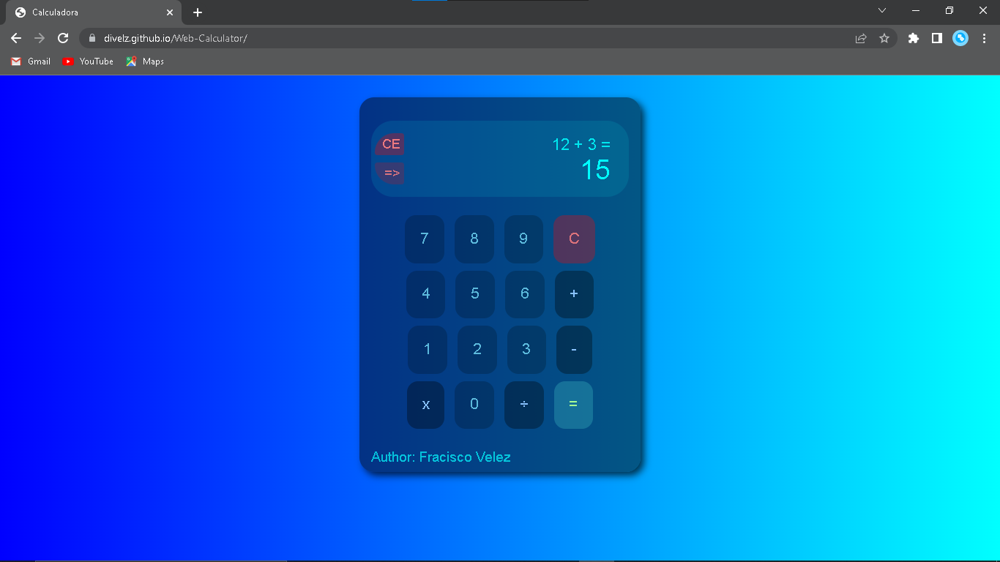
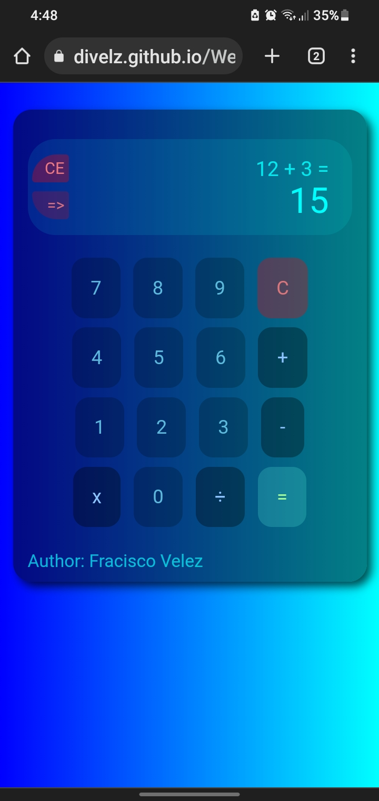

# Web-Calculator

#2 Project on the web, basic whole number calculator.

* With addition, subtraction, multiplication, division.

* Write numbers with the keyboard or pressing the buttons.

Keys when pressed:
1. All one-digit numbers. (1, 2, 3, 4, 5, 6, 7, 8, 9, 0)
2. Main operations. (+, -, *, /)
2. Equals symbol. (=)

Three delete buttons:
1. (CE) : Replaces the entire currently entered number with a zero.
2. (=>) : Delete one digit of the currently entered number from the right.
3. (C) : Eliminates all the written operation.

**Image 1**

**Image 2**

<!-- link: [Go to the website.](https://divelz.github.io/Web-Calculator/) -->

**Best regard !!!**

<cite>Author: Francisco Velez</cite>
